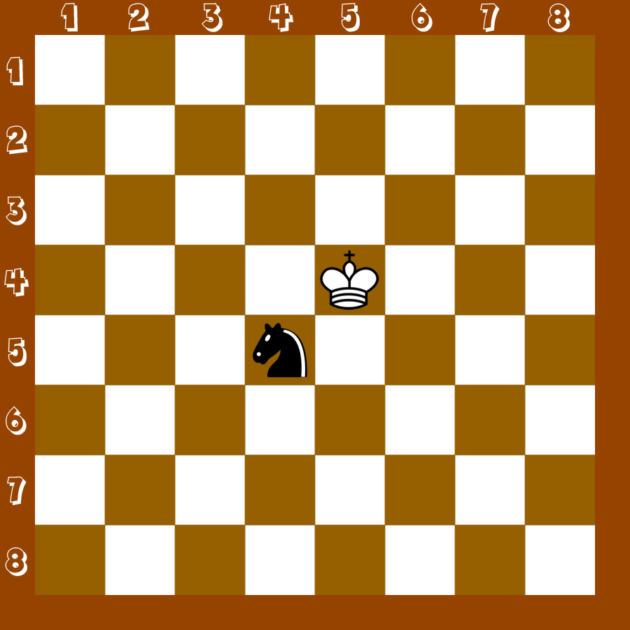

## Задание
- Написать функцию <b>king</b>, которая возвращает булиновое значение: <b>true</b>, если белый король бьёт вражескую фигуру. <b>false</b>, если не бьёт. 
- Функция принимает:
    - x1: координата белого короля по оси x.
    - y1: координата белого короля по оси y.
    - x2: координата чёрной фигуры по оси x.
    - y2: координата чёрной фигуры по оси y.
- Задачу решить, не используя if / else, тернарный оператор, switch.

## Примеры
- (5, 4, 4, 5) => true
- (5, 4, 5, 5) => true
- (3, 5, 5, 5) => false
- (3, 5, 3, 3) => false

## Примечание
- Превью: 

## Справка
- Как ходят фигуры в шахматах: https://chess-boom.online/kak-hodyat-figury-v-shahmatah
